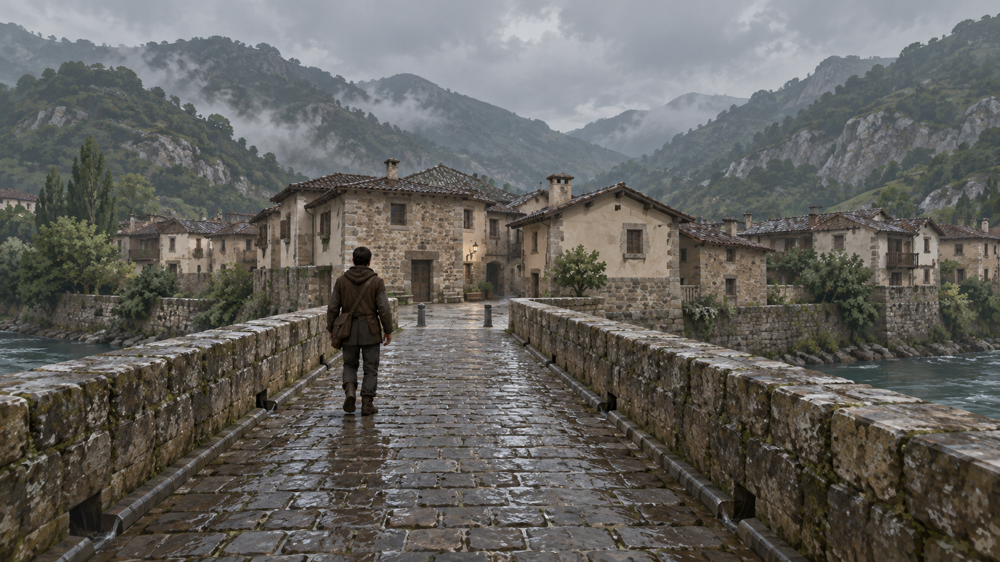
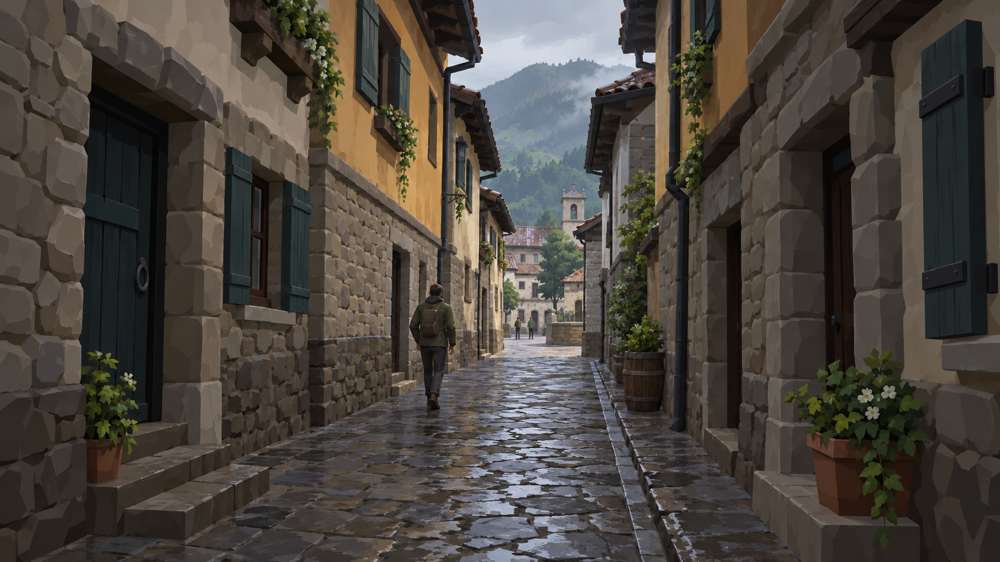
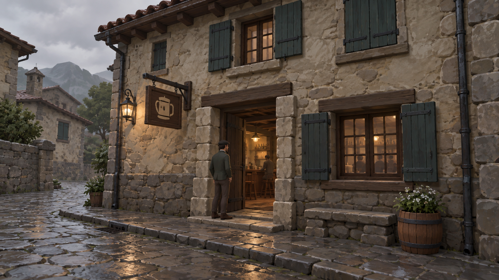

# ART-01 visual target checkpoint — frozen before kit adaptation

Frozen on 2026-09-26 against `main` `648272bb50a0c5c718a9f0f4668faaaa0482aef9`. These are **human-scale concept overpaints, not CITY geometry or a photoreal rendering target**. The accepted CITY-04 image `x1_to_casco.png` supplies the first framing; the non-canonical PR #233 images `3_subida_w12.jpg` and `5_fachada_bar.jpg` inform only the latter two human-view questions. The generated images do not adopt demo layouts, route coordinates, signs, building placement, P1/P8/P9 proposals, or any CITY-07 keeper choice.

Metric inputs available now: CITY-04 seed/projection and technical scene, `City04Layout.json` X1/S02/W12/F01 planning regions; W12 drawn width 2.8 m, X1 5.5 m, F01 planning region about 8 × 15 m. `ART_01_DIMENSIONAL_PROFILE.md` supplies 1 Unity unit = 1 m, a 1.70–1.85 m human, 0.25 m assembly snap and 0.05 m fine snap. CITY-07 still owns the final shared keeper elevation profile. The PR #233 numeric heights are observations, not target datum.

## T1 — Puente Viejo → S02

SHA-256 `d5aab595f9ae3863d0cdf3d3422c60a66eefec4e94855f9fc70ff652de4601f9`.

- **STRUCTURAL INTENT:** bridge deck, stone parapet and bridgehead surface meet as one traversable system with one collision owner; S02 reads as a public pause and the start of W12 without a parallel crossing. The town silhouette alternates 2–3-storey stone/render masses; roof/eave/gable junctions close, visible plinths meet local ground, and the water edge has a coherent retaining/shoulder condition. Door/window openings have actual depth. Keep an ordinary clothed adult in frame for scale.
- **ILLUSTRATIVE DRESSING:** exact roof count, chimney locations, tree placement, paving pattern, wet sheen, water detail and distant slope silhouettes. The image's high surface fidelity is a mood cue; the accepted game target remains low-poly with broad albedo and chunky silhouettes. Do not infer a new landmark or route from the distant roofscape.
- **Visual hierarchy:** parapet leads toward a small bridgehead opening, then staggered facades and subdued valley backdrop. Overcast high sky, muted green slopes, primary dark wet tile and restrained lime render; no alpine framing, fantasy tower or default warm terracotta.

## T2 — W12 compression → Casco reveal

SHA-256 `5e90bf5b98463f025dafc9500f16c073b2e9b0bddf428523c24184b6b296b804`.

- **STRUCTURAL INTENT:** a legible 2.8 m historic-lane traversal with singular route surface and authored drainage edge; nearby building masses compress and the accepted Casco node opens in the distance. Stone lower walls/retaining responses, wall thickness, plinths and thresholds are visible; muted render is bounded to selected upper facade panels. Roofs are integrated dark tile assemblies with eaves and end conditions. The human figure calibrates door/window heights and passage clearance.
- **ILLUSTRATIVE DRESSING:** exact window rhythm, shutters, planters, vines, barrel, tree and the distant skyline shape. None creates a new lane, public court, shortcut, tower commitment or revised grade. Vegetation is rooted or hosted at valid contacts, not a seam mask.
- **Visual hierarchy:** dark, close foreground facades yield to a brighter but overcast Casco opening. Material variation is limited to stone, restrained lime/ochre render and dark timber. The final Unity benchmark should be simpler in texture frequency than this concept painting.

## T3 — Bar F01 exterior + public threshold

SHA-256 `e2232185a531a56b6208b4a0476364f02add356e2189af12fbf57a08e9e8cfa9`.

- **STRUCTURAL INTENT:** an articulated social-house exterior with a separate plinth, thick hosted facade, true public door opening with jamb/lintel and 0.10–0.40 m reveal, continuous threshold/landing to a visible public interior floor, and a shuttered window recessed in its host. The low-to-moderate dark tile roof has a supported perimeter, closed eave and gable; street drainage/kerb and building contact are deliberate. Interior counter/chairs and clothed adult provide scale only. Accepted F01 public/service/semi-private roles remain distinct; the benchmark proves only the public threshold/exterior and enough interior context to judge scale.
- **ILLUSTRATIVE DRESSING:** sign form/icon, lamp, planter, barrel, interior bottle count, cobble pattern, remote building and exact mass placement. Warm interior accent stays small against overcast daylight. None defines a new name, entrance location, service route or room plan.
- **Visual hierarchy:** public opening and visible room are primary, recessed window and roofline secondary, props tertiary. Avoid a sign or plants hiding a wall/threshold defect.

## Target-change rule

The benchmark is inspected against these structural relations and the Visual Bible, not pixel matched to generated paintings. Any material departure in massing, roof family, wall/ground junction or hierarchy gets a reason in the candidate checkpoint: source limitation, measured composition, CITY constraint, technical/performance need or owner decision. Palette/shape vetoes remain binding unless the visual authority changes. The target files were generated with the built-in image generation tool using the three scene-specific prompts recorded in the Worker session; no source art or PR #233 file was edited.
